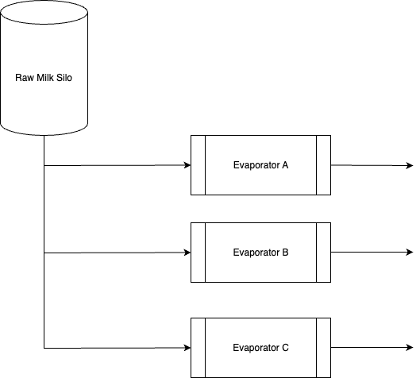

# dastabricks-evap_project
Data Engineer Interview Task At Fonterra

## Problem Statement

Using the much simplified process below, raw milk is processed through Evaporators to remove water.

There are three Evaporators, A, B, and C.

There are two modes of operation for an evaporator:

- On-product (processing milk) - State Value 1
- CIP (clean in place) - State Value 0

There are always 2 evaporators On-product and one on ClP.

The concept of a "production run" is a continuous period of time when the Evaporator is On-product.

Summary statistics need to be calculated for each Production run.

A data pipeline runs at 7 am every day and needs to incrementally process raw data to generate the summary statistics that are kept for multiple years.

The raw data from which the summary statistics are calculated are from sensors in the process that log data every 30 seconds.

When you query data from the data source the data structure will be of the format as below.

  Remember:

- On-product (processing milk) - State Value 1
- CIP (clean in place)-State Value 0

| Date_time      | EvapA_Var1 | EvapA_Var2 | EvapA_State | EvapB_Var1 | EvapB_Var2 | EvapB_State | EvapC_Var1 | EvapC_Var2 | EvapC_State
| ----------- | ----------- | --| --|--|--|--|--|--|--|
| 2025-01-01 09:00:00      | 1300       | 85 | 1 | 1000| 60 | 0 |1305 | 86 |1 |
| 2025-01-01 09:00:30   | 1302        | 85.6 | 1 |999 | 59.8 | 0 | 1302 | 85.9 | 1 |
| 2025-01-01 09:01:00   | 1299        | 85.3 | 1 | 1001 | 60.1 | 0 | 1303 | 86.2 | 1 |
| 2025-01-01 09:01:30   | 1000        | 60 | 0 | 1300 | 85 | 1 | 1300 | 86.1 | 1 |

**Note:**

Only 2 variables and a state fag are shown for each evaporator. In realty, there could be more variable columns for each evaporator.

Also, the variables (Var x ) are the same across evaporator. E.g Evap1_Var1, Evap2_Var1, Evap3_ Var1 are all the same variable, like "fowrate" for each evaporator.

**Task:**

1) Please describe what data structure you would transform the source data format to, in order to facilitate data processing.

2) Please describe how you would create summary statistics based on Production runs.

3) Please describe how you would then make this run on a daily incremental basis.
